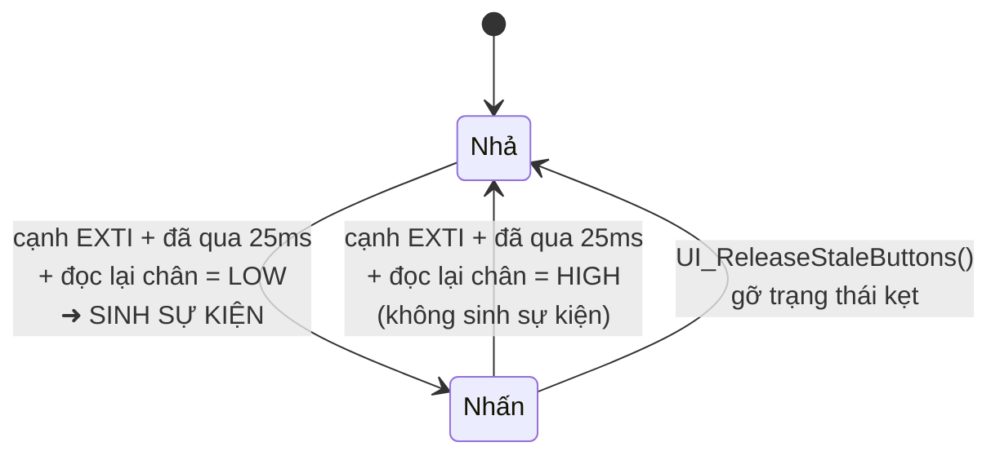

# 07 — Đặc tả giao diện OLED

## 7.1 Khung màn hình chung

Màn hình SSD1306 **128 × 64** đơn sắc. Font 5×7, mỗi ký tự chiếm 6 px bề ngang → một dòng
chứa tối đa **21 ký tự** (21 × 6 = 126 px).

```
      y=0   ┌────────────────────────────────┐  thanh tiêu đề đảo màu
            │ HOME                    BT 1/5 │  (nền trắng, chữ đen)
      y=11  ├────────────────────────────────┤
            │                                │
            │        phần thân riêng          │
            │        của từng trang           │
            │                                │
      y=63  └────────────────────────────────┘
```

### Thanh tiêu đề

Có ở **mọi** trang. Bên trái là tên trang, bên phải là `BT <trang>/<tổng>`.

- Chữ `BT ` **chỉ xuất hiện khi đã có liên lạc Bluetooth**. Sự vắng mặt của nó chính là dấu
  hiệu mất kết nối — không cần thêm chữ "NO LINK" chiếm chỗ.
- **Huy hiệu cảnh báo lỗi sức khỏe `!DHT`**: Khi cảm biến DHT11 bị lỗi hoặc mất tín hiệu (`FAULT_DHT11_DEAD`), một huy hiệu `!DHT` xuất hiện nổi bật ở giữa thanh tiêu đề trên **mọi trang**:
  ```
  ┌────────────────────────────────┐
  │ HOME        !DHT        BT 1/5 │  (nền trắng, chữ đen)
  ├────────────────────────────────┤
  ```
- Riêng trang LOG chèn thêm dải `<đầu>-<cuối>/<tổng>` ở giữa thanh tiêu đề khi không có lỗi cảm biến.

Kỹ thuật: tô đặc cả dải bằng màu trắng rồi viết chữ **đen** đè lên — glyph "khoét" ra khỏi
nền trắng.

## 7.2 Chế độ khóa và Bàn phím số ảo (Khi chưa đăng nhập Local)

Khi chủ sở hữu phiên không phải là Local (`AUTH_NONE` hoặc `AUTH_BLE`), giao diện hoàn toàn không cho phép điều khiển ngõ ra và hoạt động ở hai màn hình chuyên biệt:

---

### Màn hình 1 — Dashboard khóa (Locked Dashboard)

Màn hình tổng hợp toàn bộ thông số giám sát hệ thống mà **không cần đăng nhập**:

```
┌────────────────────────────────┐
│ LOCKED              AUTH:NONE  │  ← thanh tiêu đề đảo màu
├────────────────────────────────┤
│ TEMP: 28°C         HUMI: 65%   │
│ DHT: OK            BLE: LINK   │  ← DHT: OK / BAD; BLE: LINK / NO
│ ALARM: NORMAL                  │  ← NORMAL / HIGH / DHT_FAULT
│ OUT: 0000          OWNER: NONE │  ← Bản đồ 4 kênh OUT1..OUT4
│      >> PRESS ANY KEY <<       │  ← Nhấp nháy chỉ dẫn
└────────────────────────────────┘
```

| Phần tử | Ý nghĩa |
|---|---|
| `LOCKED` | Trạng thái khóa cục bộ |
| `AUTH: NONE / BLE` | Cho biết phiên điều khiển hiện tại do ai nắm |
| `TEMP / HUMI` | Nhiệt độ (°C) và độ ẩm (%) đo được |
| `DHT: OK` / `DHT: BAD` | Sức khỏe cảm biến DHT11 hiện tại |
| `BLE: LINK` / `BLE: NO` | Trạng thái kết nối UART với module Bluetooth |
| `ALARM: NORMAL / HIGH / FAULT` | Trạng thái cảnh báo tự động chân PA8 |
| `OUT: 0000` | Trạng thái của 4 kênh OUT1..OUT4 |
| `PRESS ANY KEY` | Hướng dẫn: bấm bất kỳ phím nào trong 5 nút vật lý để mở bàn phím ảo |

- **Quy tắc phím đầu tiên**: Khi đang ở Dashboard khóa, cú bấm đầu tiên (bất kể nút nào trong 5 nút) **chỉ có tác dụng mở bàn phím ảo**, tuyệt đối không chọn hoặc kích hoạt bất kỳ ô nào trên bàn phím.

---

### Màn hình 2 — Bàn phím số ảo 3×4 (Virtual Keypad)

Cho phép nhập mã PIN cố định 4 chữ số (`"1234"`) bằng 5 nút vật lý:

```
┌────────────────────────────────┐
│ PIN: ****                      │  ← Thanh hiển thị mã PIN (hoặc WRONG PIN)
├────────────────────────────────┤
│      [ 1 ]    [ 2 ]    [ 3 ]   │
│      [ 4 ]    [ 5 ]    [ 6 ]   │  ← 4 hàng, 3 cột
│      [ 7 ]    [ 8 ]    [ 9 ]   │
│      [ < ]    [ 0 ]   [ OK ]   │  ← Ô đang chọn: tô nền trắng chữ đen
└────────────────────────────────┘
```

- **Quy tắc điều hướng bằng 5 nút vật lý**:
  - **NEXT** (PB1): Di chuyển con trỏ sang **cột phải** (quay vòng: 0 → 1 → 2 → 0).
  - **PREV** (PA6): Di chuyển con trỏ sang **cột trái** (quay vòng: 2 → 1 → 0 → 2).
  - **UP** (PA5): Di chuyển con trỏ lên **hàng trên** (quay vòng: 0 → 3 → 2 → 1 → 0).
  - **DOWN** (PB0): Di chuyển con trỏ xuống **hàng dưới** (quay vòng: 0 → 1 → 2 → 3 → 0).
  - **OK** (PA7): Kích hoạt ô đang được con trỏ trỏ tới.
- **Quy tắc nhập liệu**:
  - Nhập số `0`..`9`: Thêm 1 chữ số vào đệm (hiển thị bằng dấu `*`), tối đa 4 số.
  - Ô `<`: Xóa lùi 1 chữ số vừa nhập.
  - Ô `OK`: Chỉ có tác dụng xác nhận khi đã nhập **đủ đúng 4 chữ số**. Bấm khi chưa đủ 4 số sẽ bị bỏ qua.
  - **Nhập sai PIN**: Thanh tiêu đề hiển thị `WRONG PIN` (khoảng 1.5 giây), toàn bộ số đã nhập tự động xóa về rỗng để người dùng thử lại ngay lập tức.
  - **Timeout 30 giây**: Nếu không có bất kỳ thao tác nút nào trong vòng 30 giây, hệ thống tự động hủy đệm PIN và quay trở về Dashboard khóa.
- **Đăng nhập thành công**:
  - Quyền sở hữu chuyển sang `AUTH_LOCAL`.
  - Nếu BLE đang giữ phiên, BLE bị thu hồi quyền và nhận bản tin `LOCAL LOGIN - KICKED\r\n`.
  - Giao diện mở khóa thành công, chuyển ngay sang **Trang 1 — HOME** của 5 trang tiêu chuẩn.
  - Sau **60 giây** không có bất kỳ thao tác nút bấm nào, phiên Local tự động hết hạn và OLED quay về Dashboard khóa.

---

## 7.3 Năm trang tiêu chuẩn (Sau khi đăng nhập Local)

Thứ tự cố định, chuyển vòng tròn bằng NEXT / PREV:

```
HOME ⇄ OUTPUTS ⇄ SENSOR ⇄ LOG ⇄ HƯỚNG DẪN ⇄ (quay lại HOME)
```

---

### Trang 1 — HOME

Dashboard tổng hợp: nhiệt độ, độ ẩm, trạng thái 4 kênh ngõ ra, uptime và sức khỏe cảm biến:

```
┌────────────────────────────────┐
│ HOME        !DHT        BT 1/5 │
├────────────────────────────────┤
│ TEMP 28°C          HUMI 65%    │
│ ▐████████░░░▌      ▐██████░░▌  │   ← hai thanh mức
│────────────────────────────────│
│ OUT    1       2       3     4 │
│       ┌─┐     ╔═╗     ┌─┐   ┌─┐│   ← 4 ô vuông OUT1..OUT4
│       └─┘     ╚═╝     └─┘   └─┘│      khung ngoài = đang chọn
│ 00:12:34              ██DHT BAD│   ← Khi lỗi: hộp đảo màu DHT BAD
└────────────────────────────────┘
```

| Phần tử | Ý nghĩa |
|---|---|
| `TEMP 28°C` | Nhiệt độ mới nhất |
| Thanh mức nhiệt | Thang **0–50 °C** (`UI_TEMP_SCALE_MAX_C`) |
| `HUMI 65%` | Độ ẩm mới nhất |
| Thanh mức ẩm | Dùng thẳng phần trăm |
| 4 ô vuông | Trạng thái 4 kênh (PB15..PB12): rỗng = TẮT, tô đặc = BẬT |
| Khung bao quanh ô | Kênh đang được con trỏ trỏ tới |
| `00:12:34` | Thời gian chạy `hh:mm:ss` kể từ khi khởi động |
| `DHT OK` / `DHT BAD` / `DHT --` | Góc phải dưới: `DHT --` nếu chưa có mẫu; `DHT OK` nếu tốt; **hộp đảo màu `DHT BAD`** khi cảm biến lỗi (thay thế hoàn toàn cờ tĩnh sai trước đây) |

---

### Trang 2 — OUTPUTS

Danh sách 4 kênh dạng bảng, thao tác bật/tắt chính tại chỗ diễn ra ở đây:

```
┌────────────────────────────────┐
│ OUTPUTS                 BT 2/5 │
├────────────────────────────────┤
│ 1 OUT-1 PB15    ON             │
│ ██2 OUT-2 PB14   OFF ██████████│   ← dòng đang chọn: đảo màu
│ 3 OUT-3 PB13    OFF            │
│ 4 OUT-4 PB12     ON            │
│                                │
└────────────────────────────────┘
```

Mỗi dòng: `<số kênh> <tên> <tên chân>  <ON|OFF>`. Tên chân lấy trực tiếp từ `pin_config.h` (`PB15`, `PB14`, `PB13`, `PB12`). Chân PA8 cũ đã thành ALARM và không xuất hiện ở trang này.

---

### Trang 3 — DHT11 SENSOR

Chi tiết cảm biến kèm thanh mức rộng và trạng thái sức khỏe cảm biến rõ ràng:

```
┌────────────────────────────────┐
│ DHT11 SENSOR            BT 3/5 │
├────────────────────────────────┤
│ TEMP                      28°C │
│ ▐███████████░░░░░░░░░░░░░░░░░▌ │
│ HUMI                       65% │
│ ▐████████████████████░░░░░░░░▌ │
│ LAST OK 4s             BT PAIR │  ← Hiện "DHT: BAD" nếu mất tín hiệu
└────────────────────────────────┘
```

Khi cảm biến gặp sự cố, dòng dưới cùng hiển thị rõ `DHT: BAD` kèm số giây kể từ lần đọc tốt cuối cùng (`LAST OK <n>s`), giúp người dùng nhận diện ngay lỗi phần cứng.

| Phần tử | Ý nghĩa |
|---|---|
| `LAST OK <n>s` | Số giây kể từ lần đọc **thành công** gần nhất |
| `NO DATA` | Chưa bao giờ đọc được |
| `BT PAIR` / `BT ----` | Tình trạng liên lạc Bluetooth |

`LAST OK` là cách phân biệt **số đo tươi với số đo đã chết** (yêu cầu FR-18): khi cảm biến
hỏng, giá trị cũ vẫn hiện trên màn hình, và nếu không có mốc thời gian thì người dùng không
có cách nào biết. Con số cứ tăng dần = cảm biến đã ngừng trả lời.

Trang này **không in phần thập phân**: DHT11 chỉ có độ phân giải 1 °C / 1 %, byte thập phân
của nó luôn bằng 0 nên `.0` chỉ là con số trang trí giả.

---

### Trang 4 — LOG

12 sự kiện gần nhất, xem 5 dòng một lúc, cuộn bằng UP/DOWN.

```
┌────────────────────────────────┐
│ LOG      8-12/12        BT 4/5 │
├────────────────────────────────┤
│ 00:02 DHT OK                   │
│ 00:04 OUT3 ON                  │
│ 00:04 DHT OK                   │
│ 00:06 OUT3 OFF                 │
│ 00:06 DHT OK                   │
└────────────────────────────────┘
```

| Thuộc tính | Giá trị |
|---|---|
| Sức chứa | **12** dòng (`UI_LOG_LINES`) |
| Hiển thị cùng lúc | **5** dòng |
| Độ dài mỗi dòng | 15 ký tự (cắt bớt nếu dài hơn) |
| Định dạng | `mm:ss <nội dung>`, mốc thời gian kể từ khi khởi động |
| Vị trí mặc định | Bám đáy — dòng mới nhất luôn ở cuối màn hình |
| `8-12/12` trên tiêu đề | Đang xem dòng 8 đến 12 trong tổng 12 |
| Khi chưa có gì | Hiện `(EMPTY)` |

Các sự kiện được ghi:

| Nội dung | Khi nào |
|---|---|
| `BOOT OK` | Khởi động xong |
| `BT LINK UP` | Nhận được byte đầu tiên từ module Bluetooth |
| `DHT OK` / `DHT FAIL` | Sau mỗi phép đo cảm biến (2 giây một lần) |
| `OUTn ON` / `OUTn OFF` | Mỗi lần một kênh đổi trạng thái, **từ cả hai đường điều khiển** |

> Lưu ý khi dùng: `DHT OK` được ghi mỗi 2 giây nên nhật ký 12 dòng bị lấp đầy trong khoảng
> **24 giây**. Muốn xem lại một sự kiện `OUTn` thì phải xem ngay. Xem
> [12](12-han-che-va-huong-phat-trien.md) §12.1.

---

### Trang 5 — HƯỚNG DẪN

Nội dung tĩnh, nhắc nhanh tập lệnh và vai trò 5 nút.

```
┌────────────────────────────────┐
│ HUONG DAN               BT 5/5 │
├────────────────────────────────┤
│ BTN: NEXT PREV UP DN           │
│      OK = BAT/TAT              │
│ CMD: LOGIN 1234/LOGOUT         │
│      ON 1-4 / OFF 1-4          │
│      STATUS TEMP HUM           │
└────────────────────────────────┘
```

Danh sách lệnh ở đây **phải khớp** với `Command_Menu[]` trong `main.c` — thêm lệnh mới thì
phải sửa cả hai chỗ (xem [06](06-giao-thuc-bluetooth.md) §6.9).

## 7.4 Bảng hành vi của nút

### Khi ở giao diện khóa (Chưa đăng nhập Local)

| Nút | Màn hình Khóa (Locked Dashboard) | Bàn phím số ảo 3×4 (Virtual Keypad) |
|---|---|---|
| **NEXT** (PB1) | Mở bàn phím ảo (không kích hoạt ô nào) | Di chuyển con trỏ sang **cột phải** (quay vòng: 0 → 1 → 2 → 0) |
| **PREV** (PA6) | Mở bàn phím ảo (không kích hoạt ô nào) | Di chuyển con trỏ sang **cột trái** (quay vòng: 2 → 1 → 0 → 2) |
| **UP** (PA5) | Mở bàn phím ảo (không kích hoạt ô nào) | Di chuyển con trỏ lên **hàng trên** (quay vòng: 0 → 3 → 2 → 1 → 0) |
| **DOWN** (PB0) | Mở bàn phím ảo (không kích hoạt ô nào) | Di chuyển con trỏ xuống **hàng dưới** (quay vòng: 0 → 1 → 2 → 3 → 0) |
| **OK** (PA7) | Mở bàn phím ảo (không kích hoạt ô nào) | Kích hoạt ô đang chọn (`0`..`9`: nhập số; `<`: xóa lùi; `OK`: xác nhận nếu đủ 4 số) |

### Khi ở 5 trang tiêu chuẩn (Sau khi đăng nhập Local)

| Nút | HOME | OUTPUTS | SENSOR | LOG | HƯỚNG DẪN |
|---|---|---|---|---|---|
| **NEXT** (PB1) | → OUTPUTS | → SENSOR | → LOG | → HƯỚNG DẪN | → HOME |
| **PREV** (PA6) | → HƯỚNG DẪN | → HOME | → OUTPUTS | → SENSOR | → LOG |
| **UP** (PA5) | con trỏ lên 1 kênh (vòng 1..4) | con trỏ lên 1 kênh (vòng 1..4) | con trỏ lên | **cuộn về quá khứ** | con trỏ lên |
| **DOWN** (PB0) | con trỏ xuống 1 kênh (vòng 1..4) | con trỏ xuống 1 kênh (vòng 1..4) | con trỏ xuống | **cuộn về hiện tại** | con trỏ xuống |
| **OK** (PA7) | bật/tắt kênh đang chọn (OUT1..OUT4) | bật/tắt kênh đang chọn (OUT1..OUT4) | bật/tắt kênh đang chọn | **nhảy về bám đáy** | bật/tắt kênh đang chọn |

Con trỏ chọn kênh là **một biến dùng chung cho mọi trang** (`ui_selected_output`): chọn kênh
3 ở trang OUTPUTS rồi chuyển sang HOME thì ô số 3 vẫn đang được khung bao.

Nút OK ở trang SENSOR và HƯỚNG DẪN vẫn bật/tắt kênh đang chọn dù trang không hiển thị con
trỏ — hệ quả của việc `UI_HandleEvent()` xử lý LOG như ngoại lệ duy nhất.

## 7.5 Nhịp vẽ lại màn hình

| Điều kiện | Hành vi |
|---|---|
| Có sự kiện nút | Vẽ lại **ngay** ở lượt vòng lặp kế tiếp |
| Có dòng nhật ký mới **và** đang ở trang LOG | Vẽ lại ngay |
| Không có gì xảy ra | Vẽ lại mỗi **500 ms** |

Một khung hình đẩy khoảng 1 KB qua I2C 400 kHz, mất **~25 ms** và **chặn** vòng lặp trong
thời gian đó. Đây là lý do màn hình không vẽ lại liên tục.

## 7.6 Chống dội phím

Mỗi nút là một máy trạng thái hai mức với **mốc thời gian riêng**:



Bốn quyết định thiết kế đằng sau:

1. **Bắt cả hai cạnh**, không chỉ cạnh xuống. Tiếp điểm cơ khí nảy cả lúc nhấn **lẫn** lúc
   nhả; nếu chỉ bắt cạnh xuống thì tiếng nảy lúc nhả — cũng toàn cạnh xuống — không phân
   biệt được với một cú bấm mới.
2. **Cạnh chỉ là lời mời đi kiểm tra; mức của chân mới là sự thật.** Hết 25 ms, ISR đọc lại
   `HAL_GPIO_ReadPin()` để chốt trạng thái.
3. **Sự kiện chỉ sinh ở lần chuyển NHẢ → NHẤN.** Nhả tay chỉ mở khoá cho cú bấm sau.
4. **Mốc thời gian riêng cho từng nút.** Một mốc dùng chung sẽ nuốt mất thao tác hai nút
   liên tiếp — chọn kênh bằng UP rồi bấm OK ngay sau đó.

**Vì sao 25 ms**: tiếp điểm nút bấm phổ thông hết nảy trong 5–10 ms. Không đặt lớn hơn
nhiều được, vì khoảng này cũng là thời gian tối thiểu của một cú chạm — nhấn rồi nhả nhanh
hơn thế thì lần nhả sẽ bị bỏ qua.

**`UI_ReleaseStaleButtons()`** chạy mỗi vòng lặp chính để gỡ trạng thái kẹt: nếu cạnh lúc
nhả tay rơi đúng vào lúc chân đang nảy và bị đọc nhầm thành vẫn-đang-nhấn, sẽ không còn
cạnh nào tới nữa và nút kẹt vĩnh viễn. Hàm này **cố ý chỉ đi theo chiều nhả và không bao
giờ sinh sự kiện** — nếu cả ISR lẫn vòng lặp chính cùng sinh được sự kiện thì hai bên có
thể chen nhau và đếm một cú bấm thành hai.

## 7.7 Ranh giới trách nhiệm

**UI không bao giờ chạm GPIO của thiết bị.** Nó chỉ điền một đề nghị:

```c
typedef struct {
    bool    toggle_output;   /* true = xin đảo trạng thái một kênh */
    uint8_t channel;         /* Kênh cần đảo, 0..OUT_COUNT-1 */
    bool    local_login;     /* true = đăng nhập local thành công */
    bool    user_activity;   /* true = có thao tác nút của user */
} UI_Request_t;
```

`main.c` đọc đề nghị này và thi hành bằng `Set_Output()`, `Auth_Login()`, hoặc `Auth_NotifyActivity()`. Ba hệ quả:

1. Chiều phụ thuộc một hướng: `main.c` → `ui.h`, không có chiều ngược lại.
2. Mọi lối vào bật/tắt — nút bấm **và** lệnh Bluetooth — đều đi qua đúng một hàm (FR-06).
3. ISR không đổi trạng thái thiết bị, nên không phải ghi nhật ký từ trong ngắt.

Mỗi lượt `UI_Task()` chỉ chở về **một** đề nghị; các sự kiện còn lại nằm yên trong hàng đợi
và được xử lý ở vòng lặp kế — chỉ vài chục micro-giây sau.

## 7.8 Màn hình khởi động

Trước khi vào vòng lặp chính, `UI_Init()` vẽ một màn hình chào:

```
┌────────────────────────────────┐
│ BOOTING                        │
├────────────────────────────────┤
│ STM32 BT NODE                  │
│                                │
│ 4 OUTPUTS  5 BUTTONS           │
│                                │
│ PA6/PB1 = DOI TRANG            │
└────────────────────────────────┘
```

Màn hình này bị thay ngay ở lần vẽ đầu tiên của `UI_Task()` (trong vòng 500 ms), nên nếu nó
**đứng yên** thì hệ thống đã treo ở đâu đó sau `UI_Init()`.
